

  

This repository contains quickstarts for [Timefold Solver](https://github.com/TimefoldAI/timefold-solver), an AI constraint solver for Java and Kotlin. 
It shows different use cases and basic implementations to get you started on your optimization journey.

## Overview

| Use Case                                                                | Notable Solver Concepts                                       |
|-------------------------------------------------------------------------|---------------------------------------------------------------|
| 🚚 <a href="#-vehicle-routing">Vehicle Routing</a>                      | Chained Through Time, Shadow Variables                        |
| 🧑 <a href="#-employee-scheduling">Employee Scheduling</a>              | Load Balancing                                                |
| 🛠️ <a href="#-maintenance-scheduling">Maintenance Scheduling</a>       | TimeGrain, Shadow Variable, Variable Listener                 |
| 📦 <a href="#-food-packaging">Food Packaging</a>                        | Service Model, Mixed Model, Shadow Variables, Pinning         |
| 🛒 <a href="#-order-picking">Order Picking</a>                          | Chained Planning Variable, Shadow Variables                   |
| 🏫 <a href="#-school-timetabling">School Timetabling</a>                | Timeslot                                                      |
| 🏭 <a href="#-facility-location-problem">Facility Location Problem</a>  | Shadow Variable                                               |
| 🎤 <a href="#-conference-scheduling">Conference Scheduling</a>          | Service Model, ValueRange on Entity, Timeslot, Justifications |
| 🛏️ <a href="#-bed-allocation-scheduling">Bed Allocation Scheduling</a> | Service Model, Allows Unassigned, Pinning                     |
| 🛫 <a href="#-flight-crew-scheduling">Flight Crew Scheduling</a>        |                                                               |
| 👥 <a href="#-meeting-scheduling">Meeting Scheduling</a>                | TimeGrain                                                     |
| ✅ <a href="#-task-assigning">Task Assigning</a>                         | Bendable Score, Chained Through Time, Allows Unassigned       |
| 📆 <a href="#-project-job-scheduling">Project Job Scheduling</a>        | Shadow Variables, Variable Listener, Strenght Comparator      |
| 🏆 <a href="#-sports-league-scheduling">Sports League Scheduling</a>    | Consecutive Sequences                                         |
| 🏅 <a href="#-tournament-scheduling">Tournament Scheduling</a>          | Pinning, Load Balancing                                       |

> [!NOTE]
> The implementations in this repository serve as a starting point and/or inspiration when creating your own application.
> Timefold Solver is a library and does not include a UI. To illustrate these use cases a rudimentary UI is included in these quickstarts.

## Getting started implementations

Our website contains several getting started guides. All of them build the <a href="#-school-timetabling">School Timetabling</a> use case.
You can find the resulting projects for each of the guides in the `getting started` folder.

- [Service](getting-started/service) (Java, Maven, Quarkus)
- [Library: Core](getting-started/hello-world) (Java, Maven)
- [Library: Quarkus Integration](getting-started/quarkus-integration) (Java, Maven, Quarkus)
- [Library: Quarkus Integration](getting-started/quarkus-integration-kotlin) (Kotlin, Maven, Quarkus)
- [Library: Spring Boot Integration](getting-started/spring-boot-integration/README.md) (Java, Maven, Spring)

## Use cases

### 🚚 Vehicle Routing

Find the most efficient routes for vehicles to reach visits, considering vehicle capacity and time windows when visits are available. Sometimes also called "CVRPTW".

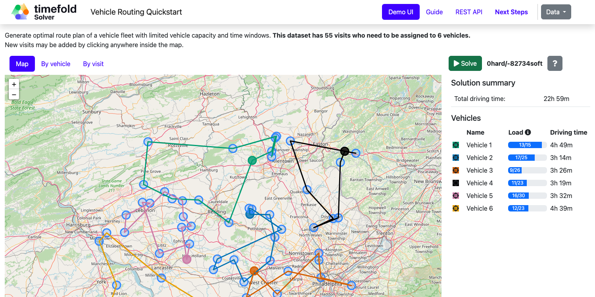

- [View constraints](use-cases/vehicle-routing/README.md#constraints)
- [Run quarkus-vehicle-routing](use-cases/vehicle-routing/README.md) (Java, Maven, Quarkus)

> [!TIP]
>   [Check out our off-the-shelf model for Field Service Routing](https://app.timefold.ai/models/field-service-routing). This model goes beyond basic Vehicle Routing and supports additional constraints such as priorities, skills, fairness and more.

---

### 🧑 Employee Scheduling

Schedule shifts to employees, accounting for employee availability and shift skill requirements.

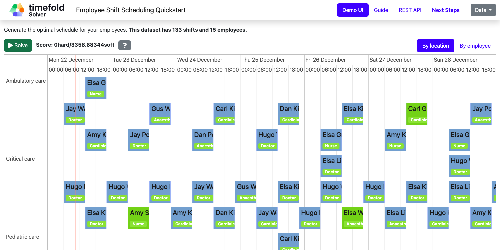

- [View constraints](use-cases/employee-scheduling/README.md#constraints)
- [Run quarkus-employee-scheduling](use-cases/employee-scheduling/README.md) (Java, Maven, Quarkus)

> [!TIP]
>   [Check out our off-the-shelf model for Employee Shift Scheduling](https://app.timefold.ai/models/employee-scheduling). This model supports many additional constraints such as skills, pairing employees, fairness and more.

---

### 🛠 Maintenance Scheduling

Schedule maintenance jobs to crews over time to reduce both premature and overdue maintenance.

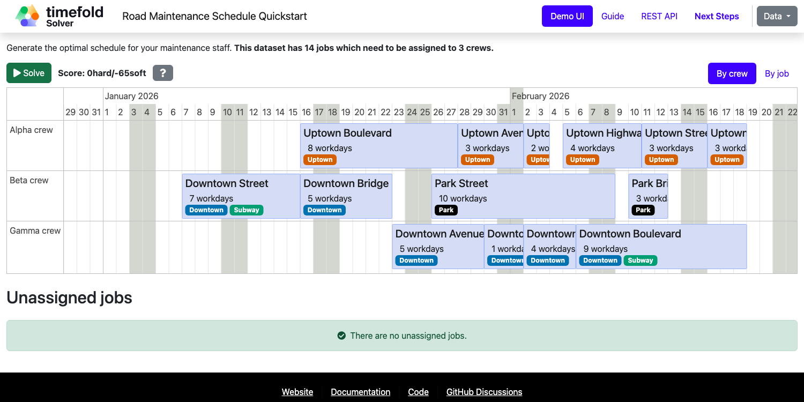

- [View constraints](use-cases/maintenance-scheduling/README.md#constraints)
- [Run quarkus-maintenance-scheduling](use-cases/maintenance-scheduling/README.md) (Java, Maven, Quarkus)

---

### 📦 Food Packaging

Schedule food packaging orders to manufacturing lines to minimize downtime and fulfill all orders on time.

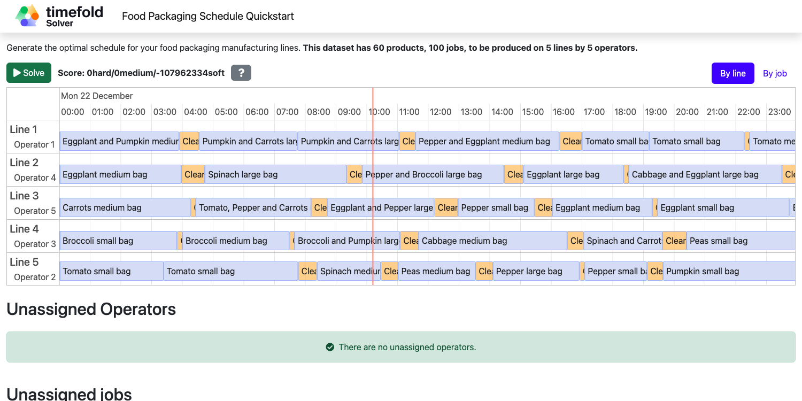

- [View constraints](use-cases/food-packaging/README.md#constraints)
- [Run quarkus-food-packaging](use-cases/food-packaging/README.md) (Java, Maven, Quarkus)

---

### 🛒 Order Picking

Generate an optimal picking plan for completing a set of orders.

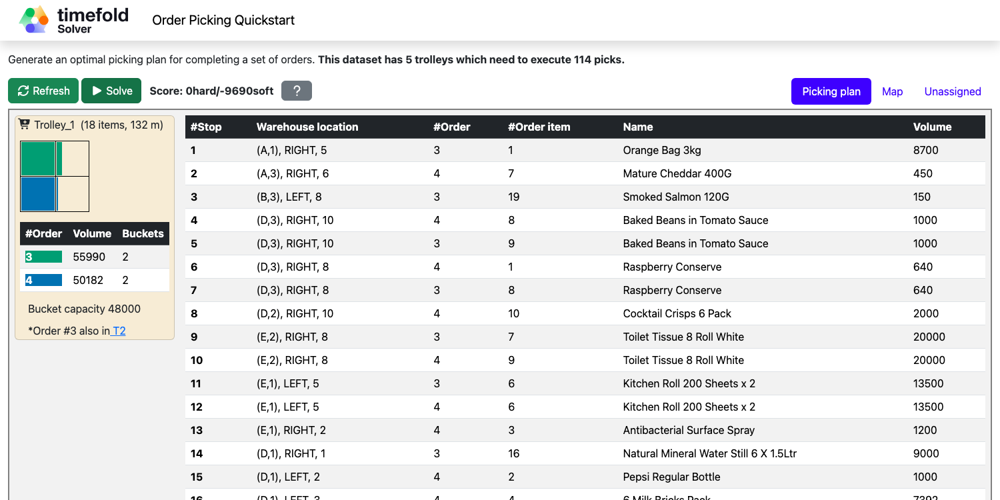

- [View constraints](use-cases/order-picking/README.md#constraints)
- [Run quarkus-order-picking](use-cases/order-picking/README.md) (Java, Maven, Quarkus)

---

### 🏫 School Timetabling

Assign lessons to timeslots and rooms to produce a better schedule for teachers and students.

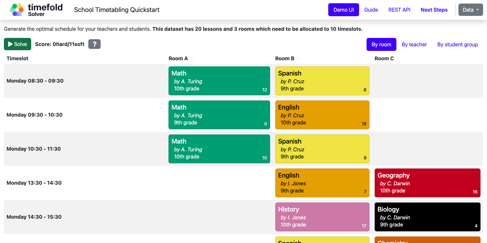

- [View constraints](use-cases/school-timetabling/README.md#constraints)
- [Run quarkus-school-timetabling](use-cases/school-timetabling/README.md) (Java, Maven or Gradle, Quarkus)
- [Run spring-boot-integration](getting-started/spring-boot-integration/README.md) (Java, Maven or Gradle, Spring Boot)
- [Run quarkus-integration-kotlin](getting-started/quarkus-integration-kotlin/README.md) (Kotlin, Maven, Quarkus)

Without a UI:

- [Service / REST API](getting-started/service) (Java, Maven, Quarkus)
- [Library / Console Application](getting-started/hello-world/README.md) (Java, Maven or Gradle)

---

### 🏭 Facility Location Problem

Pick the best geographical locations for new stores, distribution centers, COVID test centers, or telecom masts.

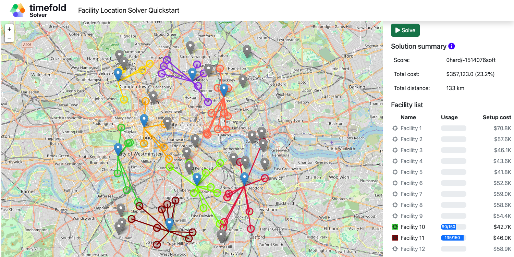

- [View constraints](use-cases/facility-location/README.md#constraints)
- [Run quarkus-facility-location](use-cases/facility-location/README.md) (Java, Maven, Quarkus)

---

### 🎤 Conference Scheduling

Assign conference talks to timeslots and rooms to produce a better schedule for speakers.

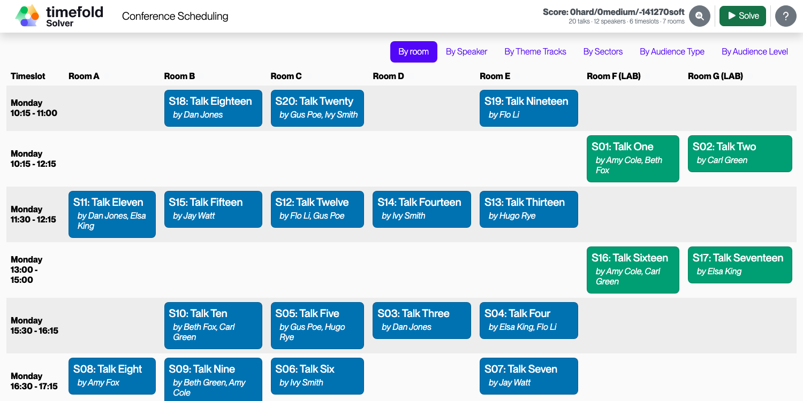

- [View constraints](use-cases/conference-scheduling/README.md#constraints)
- [Run quarkus-conference-scheduling](use-cases/conference-scheduling/README.md) (Java, Maven, Quarkus)

---

### 🛏️ Bed Allocation Scheduling

Assign beds to patient stays to produce a better schedule for hospitals.

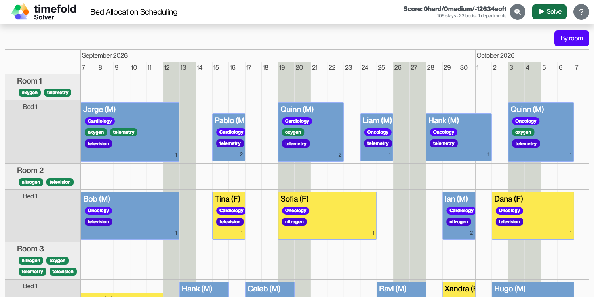

- [View constraints](use-cases/bed-allocation/README.md#constraints)
- [Run quarkus-bed-allocation-scheduling](use-cases/bed-allocation/README.md) (Java, Maven, Quarkus)

---

### 🛫 Flight Crew Scheduling

Assign crew to flights to produce a better schedule for flight assignments.

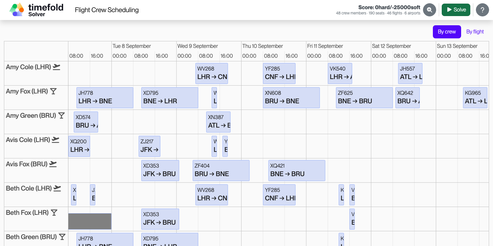

- [View constraints](use-cases/flight-crew-scheduling/README.md#constraints)
- [Run quarkus-flight-crew-scheduling](use-cases/flight-crew-scheduling/README.md) (Java, Maven, Quarkus)

---

### 👥 Meeting Scheduling

Assign timeslots and rooms for meetings to produce a better schedule.

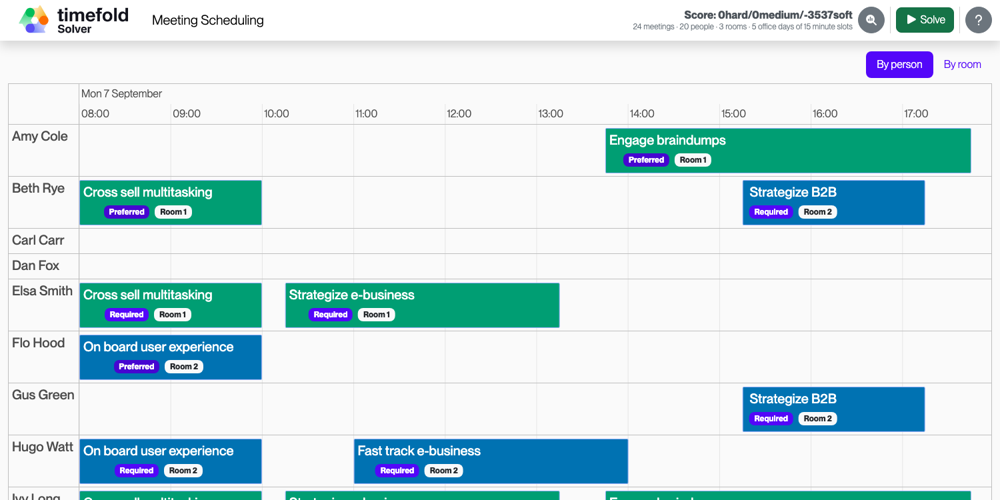

- [View constraints](use-cases/meeting-scheduling/README.md#constraints)
- [Run quarkus-meeting-scheduling](use-cases/meeting-scheduling/README.md) (Java, Maven, Quarkus)

---

### ✅ Task Assigning

Assign employees to tasks to produce a better plan for task assignments.

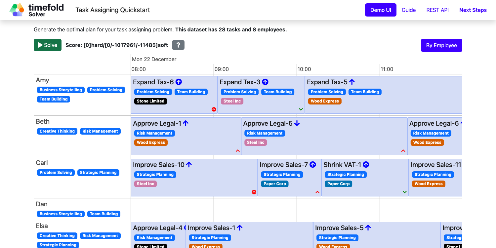

- [View constraints](use-cases/task-assigning/README.md#constraints)
- [Run quarkus-task-assigning](use-cases/task-assigning/README.md) (Java, Maven, Quarkus)

---

### 📆 Project Job Scheduling

Assign jobs for execution to produce a better schedule for project job allocations.

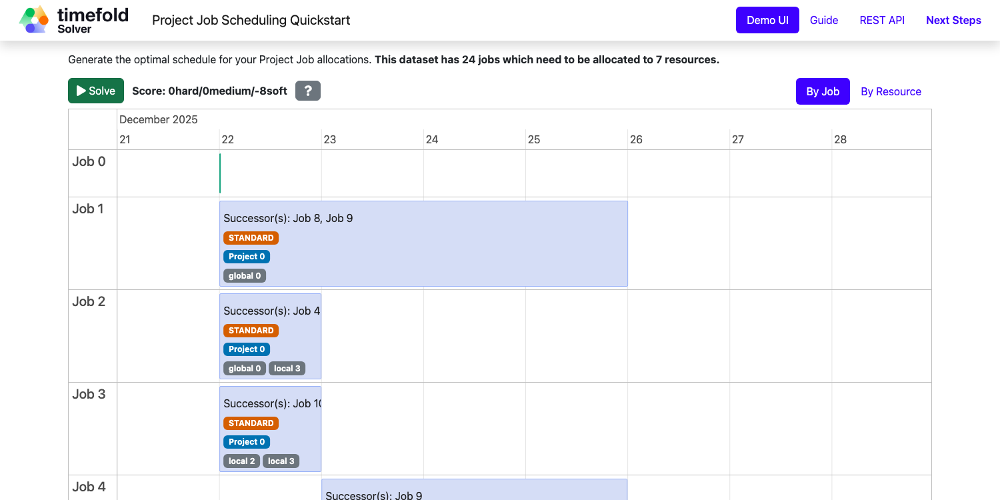

- [View constraints](use-cases/project-job-scheduling/README.md#constraints)
- [Run quarkus-project-job-scheduling](use-cases/project-job-scheduling/README.md) (Java, Maven, Quarkus)

---

### 🏆 Sports League Scheduling

Assign rounds to matches to produce a better schedule for league matches.

- [View constraints](use-cases/sports-league-scheduling/README.md#constraints)
- [Run quarkus-sports-league-scheduling](use-cases/sports-league-scheduling/README.md) (Java, Maven, Quarkus)

---

### 🏅 Tournament Scheduling

Tournament Scheduling service assigning teams to tournament matches.

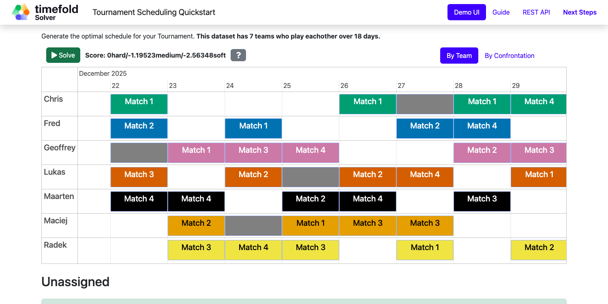

- [View constraints](use-cases/tournament-scheduling/README.md#constraints)
- [Run quarkus-tournament-scheduling](use-cases/tournament-scheduling/README.md) (Java, Maven, Quarkus)

---

## Development

Want to contribute? See [CONTRIBUTING.adoc](CONTRIBUTING.adoc).

## Legal notice

Timefold Quickstarts was [forked](https://timefold.ai/blog/2023/optaplanner-fork/) on 20 April 2023 from OptaPlanner Quickstarts, which was entirely Apache-2.0 licensed (a permissive license).

Timefold Quickstarts is a derivative work of OptaPlanner Quickstarts, which includes copyrights of the original creator, Red Hat Inc., affiliates, and contributors, that were all entirely licensed under the Apache-2.0 license. 
Every source file has been modified.
