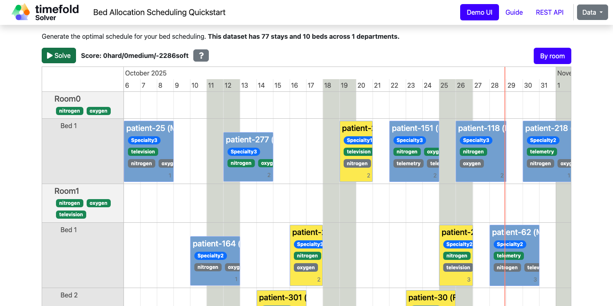

= Bed Allocation Scheduling (Java, Quarkus, Maven)

Assign beds to patient stays to produce a better schedule for hospitals.

== Constraints

[cols="1,1,3",options="header"]
|===
|Name |Level |Description

|Same bed in same night |Hard |Two patients cannot be assigned to the same bed on the same night.
|Female in male room |Hard |A female patient cannot be assigned to a male-only room (GenderLimitation.MALE_ONLY).
|Male in female room |Hard |A male patient cannot be assigned to a female-only room (GenderLimitation.FEMALE_ONLY).
|Different gender in same gender room in same night |Hard |Patients of different genders cannot share a same-gender room (GenderLimitation.SAME_GENDER) on the same night.
|Department minimum age |Hard |A patient must meet the minimum age requirement of their assigned department.
|Department maximum age |Hard |A patient must not exceed the maximum age requirement of their assigned department.
|Required patient equipment |Hard |A patient's required medical equipment must be available in the assigned bed's room.
|Assign every patient to a bed |Medium |Every patient must be assigned to a bed.
|Preferred maximum room capacity |Soft |Patients prefer rooms within their preferred maximum capacity.
|Department specialty |Soft |Stay's department specialty should match the assigned room's specialty.
|Department specialty not first priority |Soft |Penalizes when a patient is not placed in their first speciality priority.
|Preferred patient equipment |Soft |Penalizes when a patient's preferred equipment is not available in the assigned room.
|===

* <<run,Run the application>>
* <<enterprise,Run the application with Timefold Solver Enterprise Edition>>
* <<package,Run the packaged application>>
* <<container,Run the application in a container>>
* <<native,Run it native>>

== Prerequisites

. Install Java and Maven, for example with https://sdkman.io[Sdkman]:
+
----
$ sdk install java
$ sdk install maven
----

[[run]]
== Run the application

. Git clone the timefold-quickstarts repo and navigate to this directory:
+
[source, shell]
----
$ git clone https://github.com/TimefoldAI/timefold-quickstarts.git
...
$ cd timefold-quickstarts/java/bed-allocation
----

. Start the application with Maven:
+
[source, shell]
----
$ mvn quarkus:dev
----

. Visit http://localhost:8080 in your browser.

. Click on the *Solve* button.

Then try _live coding_:

. Make some changes in the source code.
. Refresh your browser (F5).

Notice that those changes are immediately in effect.

[[enterprise]]
== Run the application with Timefold Solver Enterprise Edition

For high-scalability use cases, switch to https://docs.timefold.ai/timefold-solver/latest/enterprise-edition/enterprise-edition[Timefold Solver Enterprise Edition],
our commercial offering.
https://timefold.ai/contact[Contact Timefold] to obtain the credentials required to access our private Enterprise Maven repository.

. Create `.m2/settings.xml` in your home directory with the following content:
+
--
[source,xml,options="nowrap"]
----
<settings>
  ...
  <servers>
    <server>
      <!-- Replace "my_username" and "my_password" with credentials obtained from a Timefold representative. -->
      <id>timefold-solver-enterprise</id>
      <username>my_username</username>
      <password>my_password</password>
    </server>
  </servers>
  ...
</settings>
----

See https://maven.apache.org/settings.html[Settings Reference] for more information on Maven settings.
--

. Start the application with Maven:
+
[source,shell]
----
$ mvn clean quarkus:dev -Denterprise
----

. Visit http://localhost:8080 in your browser.

. Click on the *Solve* button.

Then try _live coding_:

. Make some changes in the source code.
. Refresh your browser (F5).

Notice that those changes are immediately in effect.

[[package]]
== Run the packaged application

When you're done iterating in `quarkus:dev` mode,
package the application to run as a conventional jar file.

. Build it with Maven:
+
[source, shell]
----
$ mvn package
----
. Run the Maven output:
+
[source, shell]
----
$ java -jar ./target/quarkus-app/quarkus-run.jar
----
+
[NOTE]
====
To run it on port 8081 instead, add `-Dquarkus.http.port=8081`.
====

. Visit http://localhost:8080 in your browser.

. Click on the *Solve* button.

[[container]]
== Run the application in a container

. Build a container image:
+
[source, shell]
----
$ mvn package -Dcontainer
----
The container image name
. Run a container:
+
[source, shell]
----
$ docker run -p 8080:8080 --rm $USER/bed-allocation:1.0-SNAPSHOT
----

[[native]]
== Run it native

To increase startup performance for serverless deployments,
build the application as a native executable:

. https://quarkus.io/guides/building-native-image#configuring-graalvm[Install GraalVM and gu install the native-image tool]

. Compile it natively. This takes a few minutes:
+
[source, shell]
----
$ mvn package -Dnative
----

. Run the native executable:
+
[source, shell]
----
$ ./target/*-runner
----

. Visit http://localhost:8080 in your browser.

. Click on the *Solve* button.

== More information

Visit https://timefold.ai[timefold.ai].
