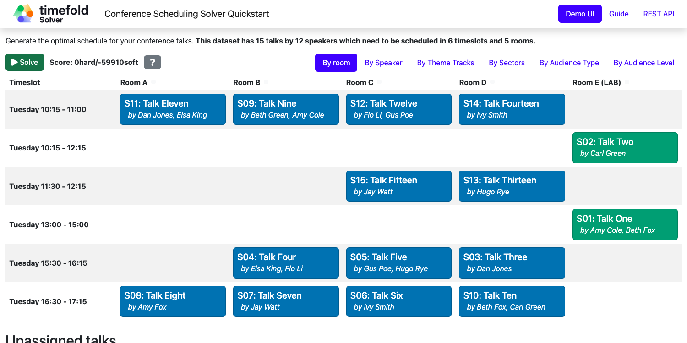

= Conference Scheduling (Java, Quarkus, Maven)

Assign conference talks to timeslots and rooms to produce a better schedule for speakers.

== Constraints

[cols="1,1,3",options="header"]
|===
|Name |Level |Description

|Room unavailable timeslot |Hard |A talk cannot be scheduled in a room that is unavailable during that timeslot.
|Room conflict |Hard |Two talks cannot be scheduled in the same room at the same time.
|Speaker unavailable timeslot |Hard |A speaker cannot give a talk during their unavailable timeslot.
|Speaker conflict |Hard |A speaker cannot give two talks simultaneously.
|Talk prerequisite talks |Hard |A talk can only be scheduled after all its prerequisite talks.
|Talk mutually exclusive talks tags |Hard |Talks with mutually exclusive tags cannot be scheduled simultaneously.
|Consecutive talks pause |Hard |A speaker must have a minimum pause between consecutive talks.
|Crowd control |Hard |Talks that have a crowd control risk must not overlap with too many other high-risk talks.
|Speaker required timeslot tags |Hard |A speaker's required timeslot tags must be present in their assigned timeslot.
|Speaker prohibited timeslot tags |Hard |A speaker's prohibited timeslot tags must not be present in their assigned timeslot.
|Talk required timeslot tags |Hard |A talk's required timeslot tags must be present in its assigned timeslot.
|Talk prohibited timeslot tags |Hard |A talk's prohibited timeslot tags must not be present in its assigned timeslot.
|Speaker required room tags |Hard |A speaker's required room tags must be present in their assigned room.
|Speaker prohibited room tags |Hard |A speaker's prohibited room tags must not be present in their assigned room.
|Talk required room tags |Hard |A talk's required room tags must be present in its assigned room.
|Talk prohibited room tags |Hard |A talk's prohibited room tags must not be present in its assigned room.
|Theme track conflict |Soft |Talks with the same theme track should not overlap.
|Theme track room stability |Soft |Talks with the same theme track should be held in the same room on the same day.
|Sector conflict |Soft |Talks targeting the same sector should not overlap.
|Audience type diversity |Soft |Talks scheduled simultaneously should target different audience types.
|Audience type theme track conflict |Soft |Talks with the same audience type and theme should not overlap.
|Audience level diversity |Soft |Talks scheduled simultaneously should have different audience levels.
|Content audience level flow violation |Soft |Talks should be ordered by increasing audience level throughout the day.
|Content conflict |Soft |Talks with the same content should not overlap.
|Language diversity |Soft |Talks scheduled simultaneously should be in different languages.
|Same day talks |Soft |A speaker's talks should be scheduled on the same day.
|Popular talks |Soft |Popular talks should be assigned to larger rooms.
|Speaker preferred timeslot tags |Soft |A speaker's preferred timeslot tags should be present in their assigned timeslot.
|Speaker undesired timeslot tags |Soft |A speaker's undesired timeslot tags should not be present in their assigned timeslot.
|Talk preferred timeslot tags |Soft |A talk's preferred timeslot tags should be present in its assigned timeslot.
|Talk undesired timeslot tags |Soft |A talk's undesired timeslot tags should not be present in its assigned timeslot.
|Speaker preferred room tags |Soft |A speaker's preferred room tags should be present in their assigned room.
|Speaker undesired room tags |Soft |A speaker's undesired room tags should not be present in their assigned room.
|Talk preferred room tags |Soft |A talk's preferred room tags should be present in its assigned room.
|Talk undesired room tags |Soft |A talk's undesired room tags should not be present in its assigned room.
|Speaker makespan |Soft |Minimize the scheduling span for each speaker.
|===

* <<run,Run the application>>
* <<enterprise,Run the application with Timefold Solver Enterprise Edition>>
* <<package,Run the packaged application>>
* <<container,Run the application in a container>>
* <<native,Run it native>>

== Prerequisites

. Install Java and Maven, for example with https://sdkman.io[Sdkman]:
+
----
$ sdk install java
$ sdk install maven
----

[[run]]
== Run the application

. Git clone the timefold-quickstarts repo and navigate to this directory:
+
[source, shell]
----
$ git clone https://github.com/TimefoldAI/timefold-quickstarts.git
...
$ cd timefold-quickstarts/java/conference-scheduling
----

. Start the application with Maven:
+
[source, shell]
----
$ mvn quarkus:dev
----

. Visit http://localhost:8080 in your browser.

. Click on the *Solve* button.

Then try _live coding_:

. Make some changes in the source code.
. Refresh your browser (F5).

Notice that those changes are immediately in effect.

[[enterprise]]
== Run the application with Timefold Solver Enterprise Edition

For high-scalability use cases, switch to https://docs.timefold.ai/timefold-solver/latest/enterprise-edition/enterprise-edition[Timefold Solver Enterprise Edition],
our commercial offering.
https://timefold.ai/contact[Contact Timefold] to obtain the credentials required to access our private Enterprise Maven repository.

. Create `.m2/settings.xml` in your home directory with the following content:
+
--
[source,xml,options="nowrap"]
----
<settings>
  ...
  <servers>
    <server>
      <!-- Replace "my_username" and "my_password" with credentials obtained from a Timefold representative. -->
      <id>timefold-solver-enterprise</id>
      <username>my_username</username>
      <password>my_password</password>
    </server>
  </servers>
  ...
</settings>
----

See https://maven.apache.org/settings.html[Settings Reference] for more information on Maven settings.
--

. Start the application with Maven:
+
[source,shell]
----
$ mvn clean quarkus:dev -Denterprise
----

. Visit http://localhost:8080 in your browser.

. Click on the *Solve* button.

Then try _live coding_:

. Make some changes in the source code.
. Refresh your browser (F5).

Notice that those changes are immediately in effect.

[[package]]
== Run the packaged application

When you're done iterating in `quarkus:dev` mode,
package the application to run as a conventional jar file.

. Build it with Maven:
+
[source, shell]
----
$ mvn package
----
. Run the Maven output:
+
[source, shell]
----
$ java -jar ./target/quarkus-app/quarkus-run.jar
----
+
[NOTE]
====
To run it on port 8081 instead, add `-Dquarkus.http.port=8081`.
====

. Visit http://localhost:8080 in your browser.

. Click on the *Solve* button.

[[container]]
== Run the application in a container

. Build a container image:
+
[source, shell]
----
$ mvn package -Dcontainer
----
The container image name
. Run a container:
+
[source, shell]
----
$ docker run -p 8080:8080 --rm $USER/conference-scheduling:1.0-SNAPSHOT
----

[[native]]
== Run it native

To increase startup performance for serverless deployments,
build the application as a native executable:

. https://quarkus.io/guides/building-native-image#configuring-graalvm[Install GraalVM and gu install the native-image tool]

. Compile it natively. This takes a few minutes:
+
[source, shell]
----
$ mvn package -Dnative
----

. Run the native executable:
+
[source, shell]
----
$ ./target/*-runner
----

. Visit http://localhost:8080 in your browser.

. Click on the *Solve* button.

== More information

Visit https://timefold.ai[timefold.ai].
