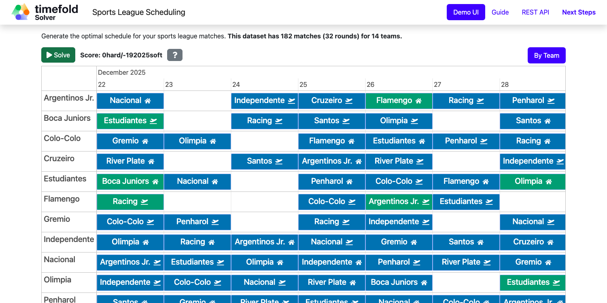

# Sports League Scheduling (Java, Quarkus, Maven)

Assign rounds to matches to produce a better schedule for league matches.



## Constraints

| Name                              | Level | Description                                                                      |
|-----------------------------------|-------|----------------------------------------------------------------------------------|
| Matches on same day               | Hard  | A team cannot play two matches on the same day.                                  |
| Multiple consecutive home matches | Hard  | A team should not play four or more consecutive home matches.                    |
| Multiple consecutive away matches | Hard  | A team should not play four or more consecutive away matches.                    |
| Repeat match on the next day      | Hard  | A team should not play a rematch against the same opponent on the following day. |
| Start to away hop                 | Soft  | Minimize travel distance for the first away match.                               |
| Home to away hop                  | Soft  | Minimize travel distance when transitioning from a home match to an away match.  |
| Away to away hop                  | Soft  | Minimize travel distance between consecutive away matches.                       |
| Away to home hop                  | Soft  | Minimize travel distance from an away match back home.                           |
| Away to end hop                   | Soft  | Minimize travel distance from the last away match.                               |
| Classic matches                   | Soft  | Classic matches should be scheduled on weekends or holidays.                     |

- [Run the application](#run-the-application)
- [Run the application with Enterprise Edition](#run-the-application-with-enterprise-edition)
- [Run the packaged application](#run-the-packaged-application)
- [Run the application in a container](#run-the-application-in-a-container)
- [Run it native](#run-it-native)

## Prerequisites

1. Install Java and Maven, for example with [Sdkman](https://sdkman.io):

   ```sh
   $ sdk install java
   $ sdk install maven
   ```

## Run the application

1. Git clone the timefold-quickstarts repo and navigate to this directory:

   ```sh
   $ git clone https://github.com/TimefoldAI/timefold-quickstarts.git
   ...
   $ cd timefold-quickstarts/java/sports-league-scheduling
   ```

2. Start the application with Maven:

   ```sh
   $ mvn quarkus:dev
   ```

3. Visit [http://localhost:8080](http://localhost:8080) in your browser.

4. Click on the **Solve** button.

Then try _live coding_:

- Make some changes in the source code.
- Refresh your browser (F5).

Notice that those changes are immediately in effect.

## Run the application with Enterprise Edition

For high-scalability use cases, switch to [Timefold Solver Enterprise Edition](https://docs.timefold.ai/timefold-solver/latest/enterprise-edition/enterprise-edition), our commercial offering.
[Contact Timefold](https://timefold.ai/contact) to obtain the commercial license.

1. Start the application with Maven:

   ```sh
   $ mvn clean quarkus:dev -Denterprise
   ```

2. Visit [http://localhost:8080](http://localhost:8080) in your browser.

3. Click on the **Solve** button.

Then try _live coding_:

- Make some changes in the source code.
- Refresh your browser (F5).

Notice that those changes are immediately in effect.

## Run the packaged application

When you're done iterating in `quarkus:dev` mode, package the application to run as a conventional jar file.

1. Build it with Maven:

   ```sh
   $ mvn package
   ```

2. Run the Maven output:

   ```sh
   $ java -jar ./target/quarkus-app/quarkus-run.jar
   ```

   > **Note**
   > To run it on port 8081 instead, add `-Dquarkus.http.port=8081`.

3. Visit [http://localhost:8080](http://localhost:8080) in your browser.

4. Click on the **Solve** button.

## Run the application in a container

1. Build a container image:

   ```sh
   $ mvn package -Dcontainer
   ```

2. Run a container:

   ```sh
   $ docker run -p 8080:8080 --rm $USER/sports-league-scheduling:1.0-SNAPSHOT
   ```

## Run it native

To increase startup performance for serverless deployments, build the application as a native executable:

1. [Install GraalVM and gu install the native-image tool](https://quarkus.io/guides/building-native-image#configuring-graalvm).

2. Compile it natively. This takes a few minutes:

   ```sh
   $ mvn package -Dnative
   ```

3. Run the native executable:

   ```sh
   $ ./target/*-runner
   ```

4. Visit [http://localhost:8080](http://localhost:8080) in your browser.

5. Click on the **Solve** button.

## More information

Visit [timefold.ai](https://timefold.ai).
