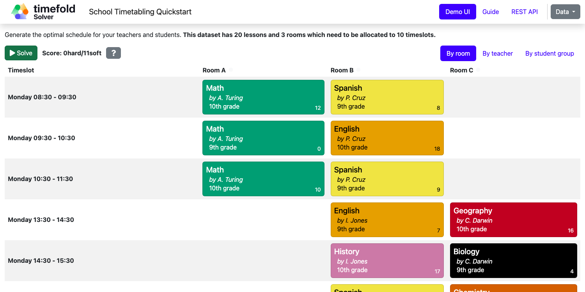

= School Timetabling (Java, Spring Boot, Maven or Gradle)

Assign lessons to timeslots and rooms to produce a better schedule for teachers and students.

== Constraints

[cols="1,1,3",options="header"]
|===
|Name |Level |Description

|Room conflict |Hard |Two lessons cannot be scheduled in the same room at the same time.
|Teacher conflict |Hard |A teacher cannot teach two lessons at the same time.
|Student group conflict |Hard |A student group cannot attend two lessons at the same time.
|Teacher room stability |Soft |A teacher should teach all their lessons in the same room.
|Teacher time efficiency |Soft |A teacher should have consecutive lessons to minimize gaps in their schedule.
|Student group subject variety |Soft |A student group should not have the same subject in consecutive timeslots.
|===

* <<run,Run the application>>
* <<enterprise,Run the application with Timefold Solver Enterprise Edition>>
* <<package,Run the packaged application>>
* <<native,Create a native image>>

== Prerequisites

. Install Java and Maven, for example with https://sdkman.io[Sdkman]:
+
----
$ sdk install java
$ sdk install maven
----

[[run]]
== Run the application

. Git clone the timefold-quickstarts repo and navigate to this directory:
+
[source, shell]
----
$ git clone https://github.com/TimefoldAI/timefold-quickstarts.git
...
$ cd timefold-quickstarts/java/spring-boot-integration
----

. Start the application with Maven:
+
[source, shell]
----
$ mvn spring-boot:run
----
+
or with Gradle:
+
[source, shell]
----
$ gradle bootRun
----

. Visit http://localhost:8080 in your browser.

. Click on the *Solve* button.

[[enterprise]]
== Run the application with Timefold Solver Enterprise Edition

For high-scalability use cases, switch to https://docs.timefold.ai/timefold-solver/latest/enterprise-edition/enterprise-edition[Timefold Solver Enterprise Edition],
our commercial offering.
https://timefold.ai/contact[Contact Timefold] to obtain the credentials required to access our private Enterprise Maven repository.

. Configure the Enterprise Edition Maven repository:
+
[tabs]
====
Maven::
+
--
Create `.m2/settings.xml` in your home directory with the following content:

[source,xml,options="nowrap"]
----
<settings>
  ...
  <servers>
    <server>
      <!-- Replace "my_username" and "my_password" with credentials obtained from a Timefold representative. -->
      <id>timefold-solver-enterprise</id>
      <username>my_username</username>
      <password>my_password</password>
    </server>
  </servers>
  ...
</settings>
----

See https://maven.apache.org/settings.html[Settings Reference] for more information on Maven settings.
--
Gradle::
+
--
Add the following in your `build.gradle`:

[source,groovy,options="nowrap"]
----
repositories {
  mavenCentral()
  maven {
    url "https://timefold.jfrog.io/artifactory/releases/"
    credentials { // Replace "my_username" and "my_password" with credentials obtained from a Timefold representative.
        username "my_username"
        password "my_password"
    }
    authentication {
        basic(BasicAuthentication)
    }
  }
}
----

See https://docs.gradle.org/current/dsl/org.gradle.api.artifacts.repositories.AuthenticationSupported.html#content[Settings Reference] for more information on Gradle settings.
--
====

. Start the application with Maven:
+
[source, shell]
----
$ mvn spring-boot:run -Denterprise
----
+
or with Gradle:
+
[source, shell]
----
$ gradle bootRun -Denterprise=true
----

. Visit http://localhost:8080 in your browser.

. Click on the *Solve* button.

[[package]]
== Run the packaged application

When you're ready to deploy the application,
package the project to run as a conventional jar file.

. Build it with Maven:
+
[source, shell]
----
$ mvn package
----
+
or with Gradle:
+
[source, shell]
----
$ gradle clean build
----

. Run the Maven output:
+
[source, shell]
----
$ java -jar target/spring-boot-school-timetabling-1.0-SNAPSHOT.jar
----
+
or the Gradle output:
+
[source, shell]
----
$ java -jar build/libs/spring-boot-school-timetabling-1.0-SNAPSHOT.jar
----
+
[NOTE]
====
To run it on port 8081 instead, add `-Dserver.port=8081`.
====

. Visit http://localhost:8080 in your browser.

. Click on the *Solve* button.

[[native]]
== Create a native image

IMPORTANT: The solver runs considerably slower in a native image.

If you want faster startup times or need to deploy to an environment without a JVM, you can build a native image.

=== Build using Docker

. Build a Docker image with Maven:
+
[source, shell]
----
$ mvn -Pnative spring-boot:build-image
----
+
or with Gradle:
+
[source, shell]
----
$ gradle bootBuildImage
----
+
. Start the built Docker image using `docker run`:
+
[source, shell]
----
$ docker run --rm -p 8080:8080 docker.io/library/spring-boot-school-timetabling:1.0-SNAPSHOT
----
+
. Visit http://localhost:8080 in your browser.

. Click on the *Solve* button.

=== Build using locally installed GraalVM

. Build it with Maven:
+
[source, shell]
----
$ mvn -Pnative native:compile
----
+
or with Gradle:
+
[source, shell]
----
$ gradle nativeCompile
----

. Run the Maven output:
+
[source, shell]
----
$ ./target/spring-boot-school-timetabling
----
+
or the Gradle output:
+
[source, shell]
----
$ ./build/native/nativeCompile/java-spring-boot
----
+
[NOTE]
====
To run it on port 8081 instead, add `-Dserver.port=8081`.
====

. Visit http://localhost:8080 in your browser.

. Click on the *Solve* button.

== More information

Visit https://timefold.ai[timefold.ai].
